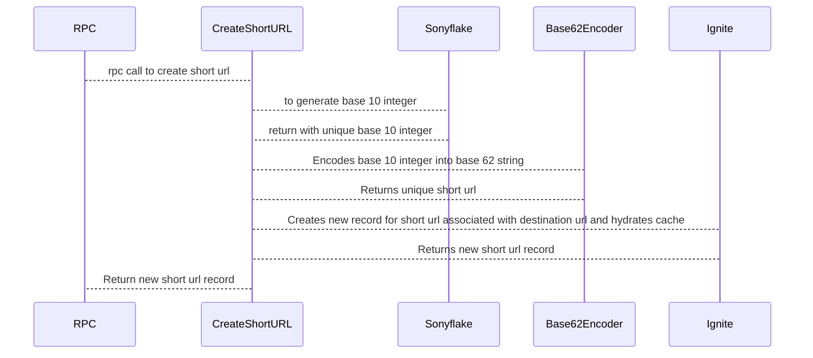

# url-shortener

URL Shortener - gRPC based microservice using GO and Apache Ignite

## Technologies

1. [Apache Ignite](https://ignite.apache.org/): For storing short urls with original (Distributed data mesh/cache with disk persistance supporting sql and transactions with cache)
2. [gRPC](https://grpc.io/): For high speed and type based maintainable apis to be used as internally within backend microservice

## Dependencies

1. [Buf](https://buf.build/): For generating code from proto files, lint for proto files
2. [Sonyflake](https://github.com/sony/sonyflake): For generating unique base 10 integer used withing generating short url algorithm

# Running the app

```
make run
```

# How it works

## Generate new short url



<br>
<br>

## Short URL Algorithm

### URL encoding through base62

A base is a number of digits or characters that can be used to represent a particular number.

Base 10 are digits [0–9], which we use in everyday life and

base 62 are [0–9][a-z][A-Z]

Let’s do a back of the envelope calculation to find out how many characters shall we keep in our tiny url.

```
URL with length 5, will give 62⁵ = ~916 Million URLs
URL with length 6, will give 62⁶ = ~56 Billion URLs
URL with length 7, will give 62⁷ = ~3500 Billion URLs
```

How to get unique ‘7 character’ long random URLs in base62:

Technique 1 — Short url from random numbers: Using this technique there could be cases where we can have a collision of already existing short url in the database and we need to have a logic to retry until succeed. And Because of that reason we are not going with this approach

Technique 2: — Short urls from base conversion: Think of the seven-bit short url as a hexadecimal number (0–9, a-z, A-Z) (For e.g. aKc3K4b) .Each short url can be mapped to a decimal integer by using base conversion and vice versa.
So we can generate base 10 integer using snowflakes ids which are unique over the distributed system remove the need of the collision check and convert it to base 62 to get the short url. <br>
Resource links: <br>

1. https://medium.com/@sandeep4.verma/system-design-scalable-url-shortener-service-like-tinyurl-106f30f23a82
2. https://stackoverflow.com/questions/742013/how-do-i-create-a-url-shortener
